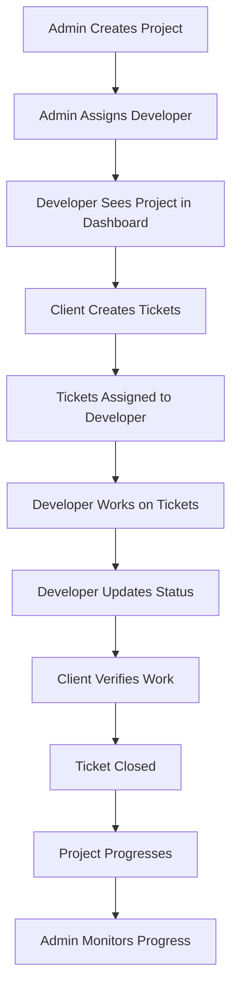

# Developer Assignment & Project Management Guide

This guide explains how admins assign developers to projects and how developers see and work on their assigned tasks.

## Table of Contents
1. [Admin: Assigning Developers to Projects](#admin-assigning-developers)
2. [Developer: Viewing Assigned Projects](#developer-dashboard)
3. [Working on Tickets](#working-on-tickets)
4. [Workflow Overview](#workflow-overview)

---

## Admin: Assigning Developers to Projects

### How to Assign a Developer to a Project

1. **Login as Admin**
   - Email: `admin@system.com`
   - Password: `admin123`

2. **Go to Admin Dashboard**
   - Navigate to http://localhost:3002/admin/dashboard
   - You'll see all projects in a table format

3. **Edit a Project**
   - Click the **"Edit"** link in the Actions column for any project
   - Or go directly to `/admin/projects/[project-id]/edit`

4. **Assign Team Members**
   In the edit form, you can assign:
   - **Client** (required) - The project owner/client
   - **Web Developer** (optional) - Developer who will build/maintain the website
   - **Social Media Coordinator** (optional) - Coordinator for social media management

5. **Set Project Details**
   - Project name and description
   - Website URL
   - Google Analytics IDs
   - Current stage (Planning, Design, Development, Testing, Launch, Maintenance)
   - Status (Active, Paused, Completed)

6. **Save Changes**
   - Click **"Save Changes"**
   - The developer will immediately see the project in their dashboard

### What Happens After Assignment?

When you assign a developer to a project:

✅ **Developer sees the project** in their dashboard at `/developer/dashboard`

✅ **Developer can view project details** at `/developer/projects/[project-id]`

✅ **Developer sees all tickets** assigned to them for that project

✅ **Developer can work on tickets** and update their status

---

## Developer: Viewing Assigned Projects

### Developer Dashboard

When a developer logs in, they are automatically redirected to `/developer/dashboard`.

**What Developers See:**

1. **Statistics Cards**
   - Assigned Projects count
   - Open Tickets count
   - In Progress Tickets count
   - Resolved Tickets count

2. **My Projects Section**
   - List of all projects assigned to them
   - Project name, description, client info
   - Current stage and status
   - Number of tickets assigned
   - Quick link to view project details

3. **My Tickets Section**
   - Recent tickets assigned to them
   - Ticket title, description, priority
   - Status of each ticket
   - Link to view ticket details

### Developer Project View

At `/developer/projects/[project-id]`, developers can:

- View full project details
- See project stage and status
- View all tickets for the project
- Access the project website (if available)
- See project notes and requirements

---

## Working on Tickets

### How Tickets are Created and Assigned

1. **Client Creates Ticket**
   - Clients can create tickets for their projects
   - Tickets include:
     - Title and description
     - Type (Bug Report, Content Change, Design Update, Feature Request)
     - Priority (Low, Medium, High, Critical)

2. **Admin or Client Assigns Ticket**
   - Tickets can be assigned to specific developers
   - Developers see assigned tickets in their dashboard

3. **Developer Works on Ticket**
   - Developer can view ticket details
   - Update ticket status:
     - **Open** → Ticket created, not started
     - **In Progress** → Developer is working on it
     - **Resolved** → Developer completed the work
     - **Closed** → Ticket verified and closed

4. **Communication**
   - Developers and clients can add comments to tickets
   - Track progress and discuss requirements

### Ticket Workflow Example

```
1. Client creates ticket: "Fix mobile navigation bug"
   Status: OPEN
   Priority: HIGH
   Assigned to: Developer

2. Developer sees ticket in dashboard
   Updates status: IN PROGRESS
   Adds comment: "Working on this now"

3. Developer fixes the bug
   Updates status: RESOLVED
   Adds comment: "Fixed navigation issue, ready for testing"

4. Client tests and verifies
   Updates status: CLOSED
```

---

## Workflow Overview

### Complete Project Workflow



### Roles and Responsibilities

| Role | Responsibilities |
|------|-----------------|
| **Admin** | - Assign developers to projects<br>- Monitor all projects and tickets<br>- Manage users and system settings<br>- View analytics |
| **Developer** | - Build and maintain assigned websites<br>- Fix bugs and implement features<br>- Update ticket status<br>- Communicate with clients via tickets |
| **Client** | - Create tickets for changes/bugs<br>- Monitor project progress<br>- Verify completed work<br>- Provide requirements and feedback |
| **Social Media Coordinator** | - Manage social media analytics<br>- Track engagement metrics<br>- Coordinate social media strategy |

---

## Quick Reference

### Admin URLs
- Dashboard: `/admin/dashboard`
- Edit Project: `/admin/projects/[id]/edit`
- View Project: `/admin/projects/[id]`

### Developer URLs
- Dashboard: `/developer/dashboard`
- Projects List: `/developer/projects`
- Project Details: `/developer/projects/[id]`
- Tickets List: `/developer/tickets`
- Ticket Details: `/developer/tickets/[id]`

### Test Accounts

```javascript
// Admin Account
Email: admin@system.com
Password: admin123

// Developer Account
Email: dev@system.com
Password: dev123

// Client Account
Email: client@system.com
Password: client123
```

---

## Step-by-Step Example

### Scenario: Assigning a New Website Project

1. **Admin logs in** (admin@system.com)
2. **Admin goes to Edit Project** for "SpecCon Website"
3. **Admin assigns:**
   - Web Developer: John Developer (dev@system.com)
   - Client: Michael Client (client@system.com)
4. **Admin saves changes**

5. **Developer logs in** (dev@system.com)
6. **Developer sees "SpecCon Website"** in their dashboard
7. **Developer clicks** "View Project"
8. **Developer sees** project details and any existing tickets

9. **Client logs in** (client@system.com)
10. **Client creates ticket**: "Update homepage banner image"
11. **Client assigns ticket** to John Developer

12. **Developer sees new ticket** in dashboard
13. **Developer updates status** to "In Progress"
14. **Developer completes work**
15. **Developer updates status** to "Resolved"

16. **Client verifies work**
17. **Client closes ticket**

---

## Features Summary

### For Admins
✅ Assign developers to projects
✅ View all projects in table format
✅ Edit project details and assignments
✅ Monitor all tickets and progress
✅ Access Google Analytics
✅ Manage users and roles

### For Developers
✅ See assigned projects automatically
✅ View project details and requirements
✅ See all tickets assigned to them
✅ Update ticket status
✅ Add comments to tickets
✅ Track their workload

### For Clients
✅ Create tickets for their projects
✅ Assign tickets to developers
✅ Monitor ticket progress
✅ Verify completed work
✅ Communicate with developers

---

## Troubleshooting

### Developer Can't See Assigned Project

**Solution:**
1. Check that project is assigned in admin edit page
2. Refresh developer dashboard
3. Check that `webDeveloperId` matches developer's ID in database

### Tickets Not Showing

**Solution:**
1. Verify ticket is assigned to correct developer
2. Check that `assignedTo` field has developer's user ID
3. Refresh the page

### Changes Not Reflecting

**Solution:**
1. Clear browser cache
2. Clear localStorage: `localStorage.clear()`
3. Reload the application

---

## Database Structure (localStorage)

The system uses localStorage with these keys:

```javascript
{
  "marketing_management_website_users": [...],
  "marketing_management_website_projects": [...],
  "marketing_management_website_tickets": [...],
  "marketing_management_website_comments": [...]
}
```

### Project Object Structure

```typescript
{
  id: "proj-1",
  name: "SpecCon Website",
  description: "Main corporate website",
  clientId: "user-5",
  webDeveloperId: "user-2",  // Assigned developer
  socialMediaCoordinatorId: "user-4",
  currentStage: "development",
  status: "active",
  websiteUrl: "https://speccon.co.za",
  googleAnalyticsPropertyId: "G-XXXXXXXXXX",
  createdAt: Date,
  updatedAt: Date
}
```

### Ticket Object Structure

```typescript
{
  id: "ticket-1",
  projectId: "proj-1",
  createdBy: "user-5",  // Client
  assignedTo: "user-2",  // Developer
  title: "Fix navigation bug",
  description: "Navigation not working on mobile",
  type: "bug_report",
  priority: "high",
  status: "in_progress",
  createdAt: Date,
  updatedAt: Date
}
```

---

## Next Steps

1. ✅ **Assign developers to existing projects**
2. ✅ **Have developers log in and explore their dashboard**
3. ✅ **Create test tickets and assign them**
4. ✅ **Practice the complete workflow**
5. 📝 **Set up real Google Analytics** (optional)
6. 📝 **Customize project stages** if needed
7. 📝 **Add more users** as your team grows

---

## Support

For questions or issues:
- Check this guide first
- Review the code in `/app/admin`, `/app/developer`, `/app/client`
- Check the mock data in `/lib/mock-data.ts`
- Review types in `/types/index.ts`
